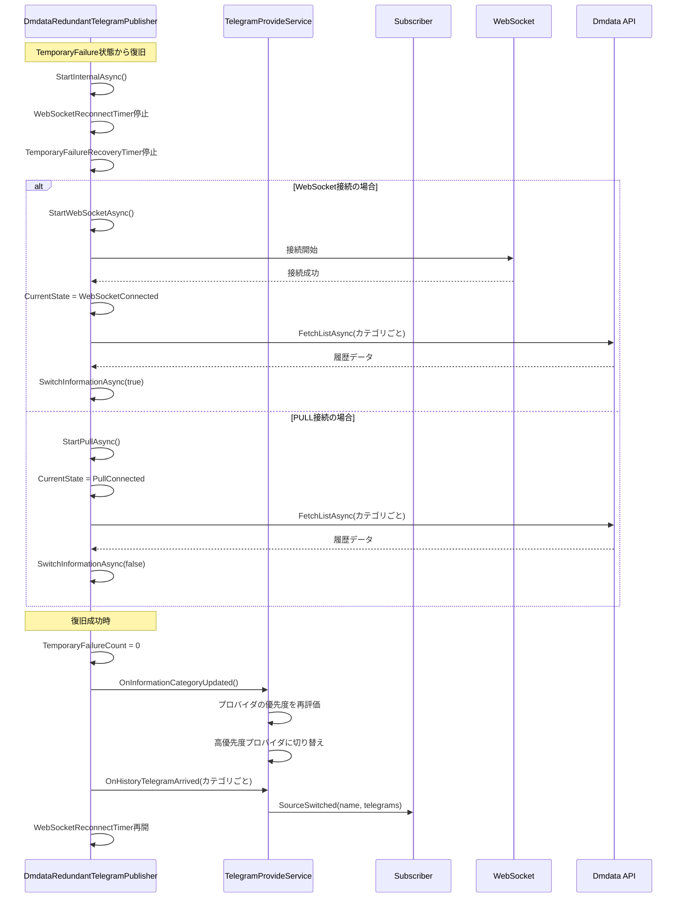
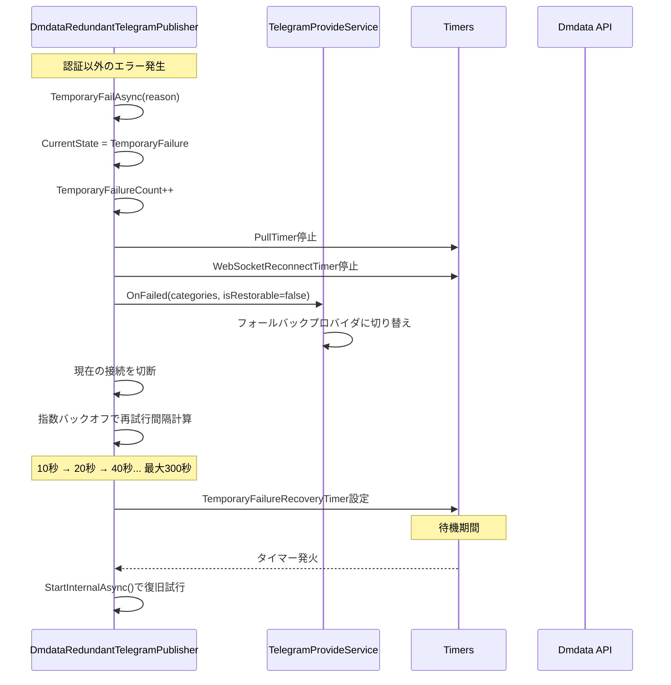
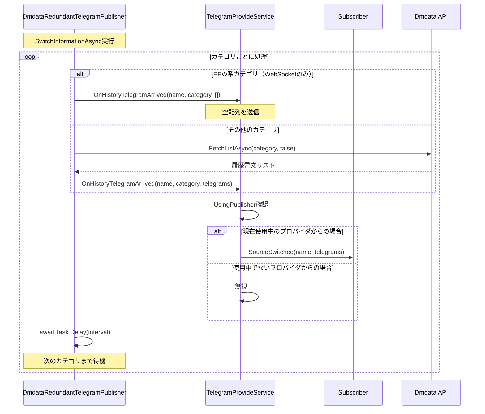
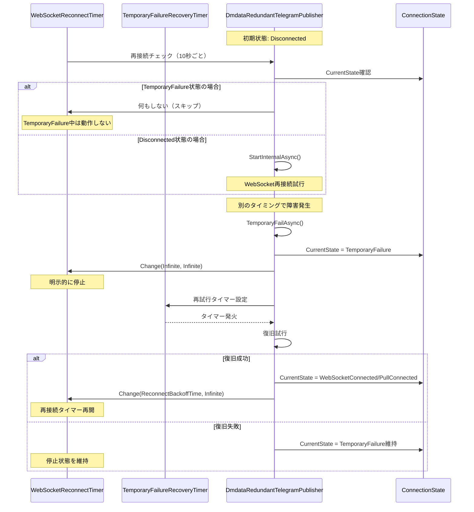
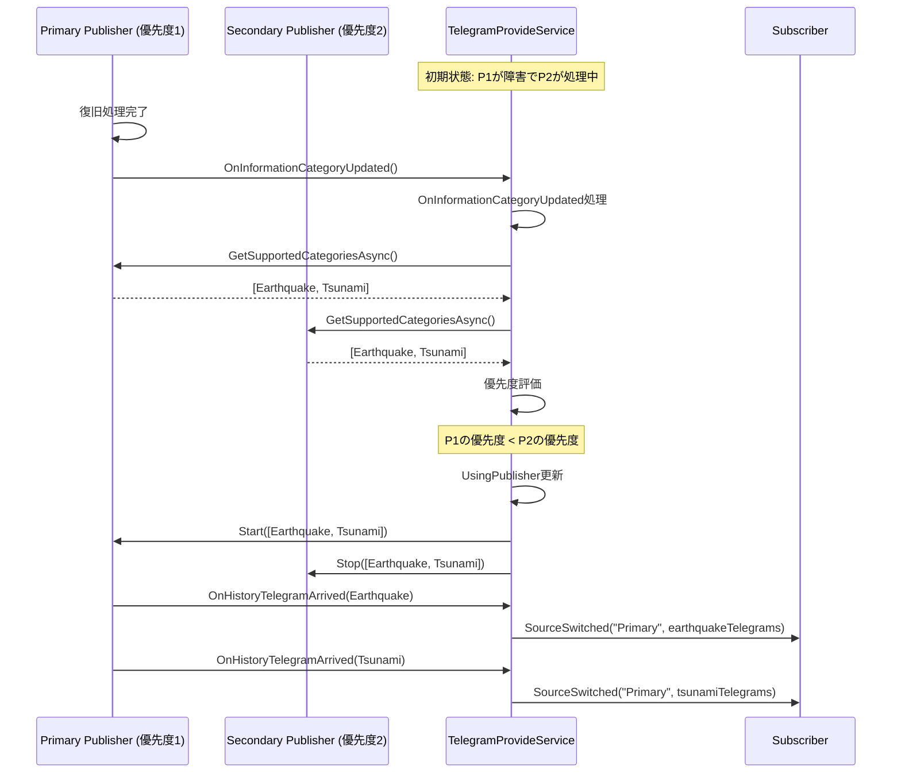

# DmdataRedundantTelegramPublisher シーケンス図

## 1. 正常な復旧フロー

## 2. 一時的障害（TemporaryFailure）の処理フロー

## 3. 複数カテゴリーの履歴送信フロー

## 4. タイマー競合の防止フロー

## 5. プロバイダ優先度による切り替えフロー

## 主な改善点

### 1. タイマー競合の防止
- `TemporaryFailure`状態では`WebSocketReconnectTimer`が動作しない
- 復旧成功時にのみ`WebSocketReconnectTimer`を再開

### 2. 履歴送信の順序保証
- `OnInformationCategoryUpdated`を先に呼び出し
- その後`OnHistoryTelegramArrived`を呼び出す

### 3. 複数カテゴリーの処理
- カテゴリーごとに順次処理
- 各カテゴリー間で適切な遅延を設定

## 注意事項

1. **履歴データの重複送信**
   - 複数のプロバイダが同時に復旧した場合、短時間に複数の履歴データが送信される可能性がある
   - `TelegramProvideService`側でUsingPublisherチェックにより、適切なプロバイダからのデータのみを処理

2. **カテゴリーごとの処理遅延**
   - `SwitchInformationAsync`内で各カテゴリー処理後に`await Task.Delay(interval)`を実行
   - これにより連続的な履歴送信を緩和

3. **状態遷移の管理**
   - `ConnectionState`により接続状態を厳密に管理
   - 不適切な状態での処理をスキップ