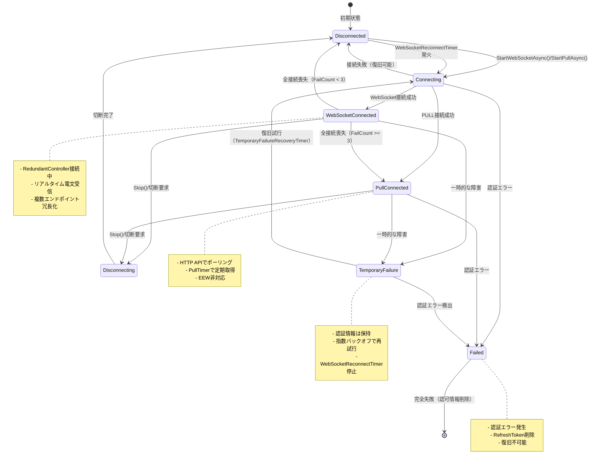
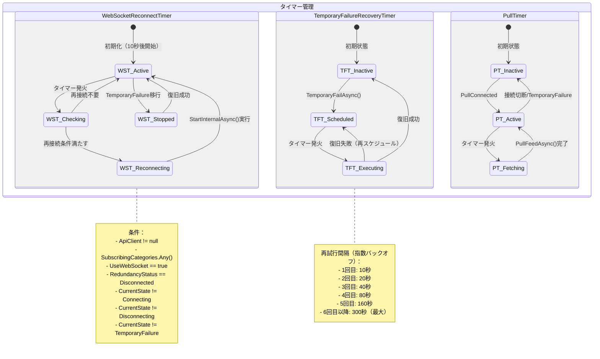
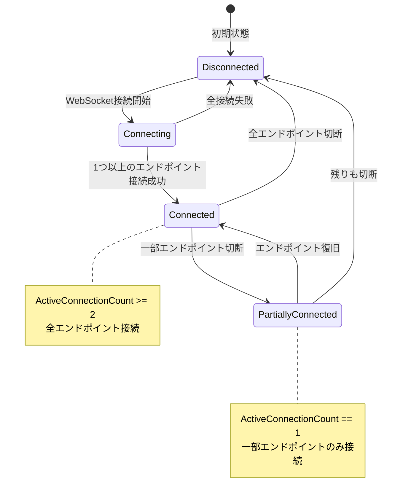
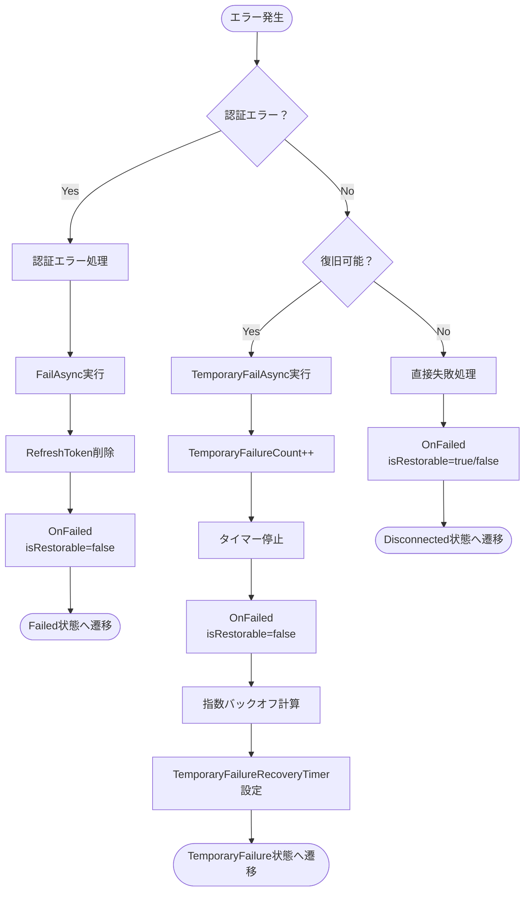
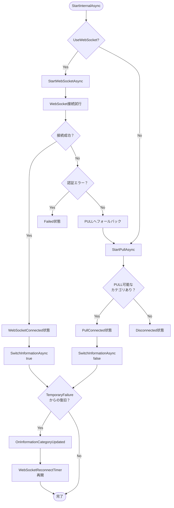

# DmdataRedundantTelegramPublisher 状態遷移図

## ConnectionState 状態遷移図

## タイマー制御の状態図

## 冗長性状態（RedundancyStatus）の遷移

## エラー処理と復旧の判定フロー

## WebSocket/PULL切り替えロジック

## 主要な状態遷移ルール

### 1. **Disconnected → Connecting**
- トリガー: `StartWebSocketAsync()` または `StartPullAsync()`
- 条件: `ApiClient != null`

### 2. **Connecting → WebSocketConnected/PullConnected**
- トリガー: 接続成功
- アクション: `SwitchInformationAsync()`実行

### 3. **WebSocketConnected → TemporaryFailure**
- トリガー: 認証以外のエラー
- アクション: 
  - `WebSocketReconnectTimer`停止
  - `TemporaryFailureRecoveryTimer`開始
  - フォールバック通知

### 4. **TemporaryFailure → Connecting**
- トリガー: `TemporaryFailureRecoveryTimer`発火
- アクション: `StartInternalAsync()`実行

### 5. **Any → Failed**
- トリガー: 認証エラー（401系）
- アクション:
  - 全タイマー停止
  - RefreshToken削除
  - 復旧不可能通知

## 状態遷移時のタイマー制御

| 現在の状態 | 次の状態 | WebSocketReconnectTimer | TemporaryFailureRecoveryTimer | PullTimer |
|-----------|---------|-------------------------|------------------------------|-----------|
| Disconnected | Connecting | 継続 | 停止 | 停止 |
| Connecting | WebSocketConnected | 継続 | 停止 | 停止 |
| Connecting | PullConnected | 継続 | 停止 | 開始 |
| WebSocketConnected | TemporaryFailure | **停止** | 開始 | 停止 |
| PullConnected | TemporaryFailure | **停止** | 開始 | 停止 |
| TemporaryFailure | Connecting | 停止維持 | 継続 | 停止 |
| TemporaryFailure復旧 | Connected | **再開** | 停止 | 状態による |
| Any | Failed | 停止 | 停止 | 停止 |

## 重要なポイント

1. **TemporaryFailure中はWebSocketReconnectTimerを停止**
   - 復旧メカニズムの競合を防止
   - TemporaryFailureRecoveryTimerのみが動作

2. **復旧成功時にWebSocketReconnectTimerを再開**
   - 将来の切断に備える
   - 通常の再接続メカニズムを有効化

3. **認証エラーは即座にFailed状態へ**
   - 復旧試行しない
   - ユーザーの再認証が必要

4. **指数バックオフによる再試行**
   - TemporaryFailureでの再試行間隔を段階的に延長
   - サーバー負荷軽減